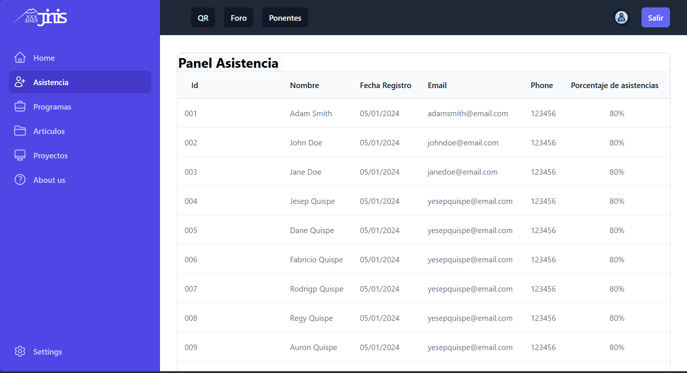

# Prototipo de Sistema de Asistencia



### Pasos para iniciar el proyecto

Primero ingrese a la carpeta frontend e ingrese los siguientes comandos

#### Instalar paquetes
```bash
bun i
```

#### Correr el servidor
```bash
bun run dev
```

## Josse Manuel Gallegos Zuñiga 